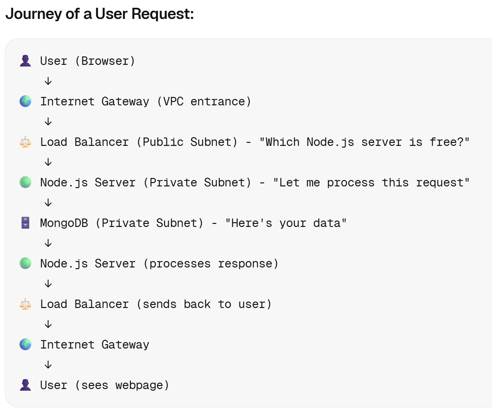
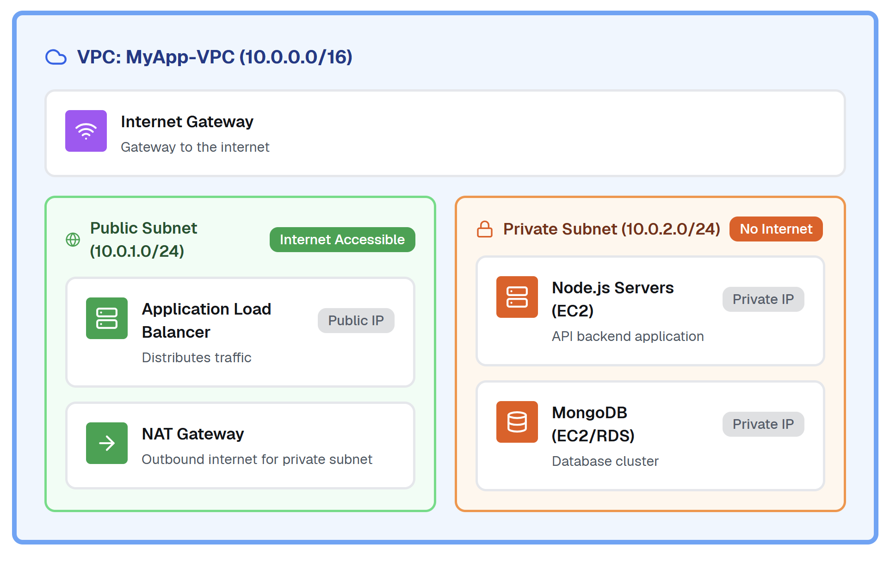
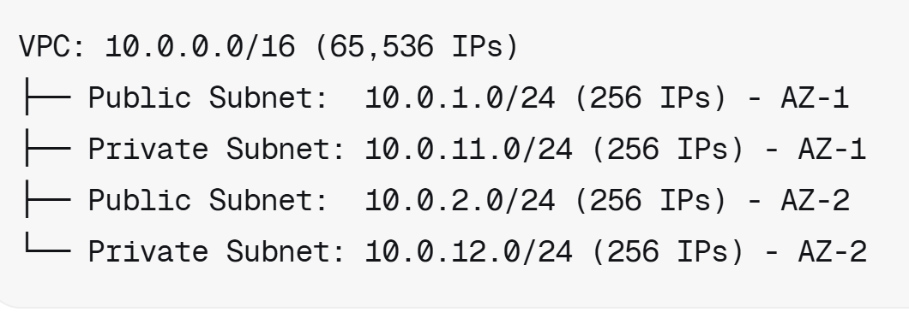
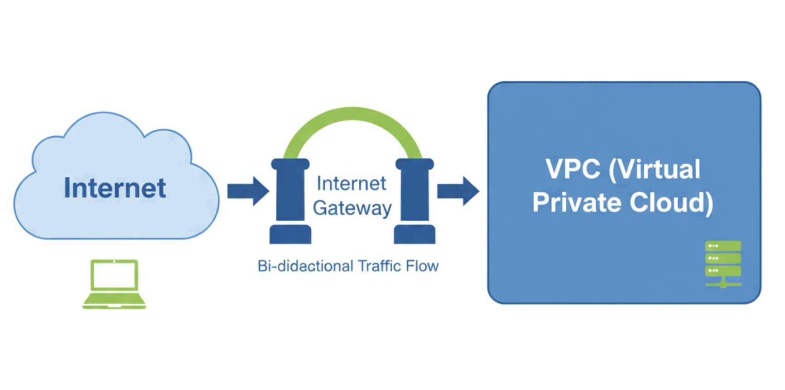
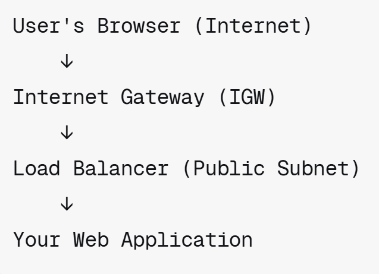
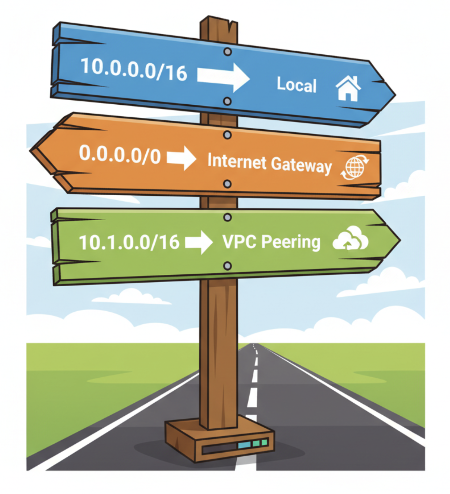
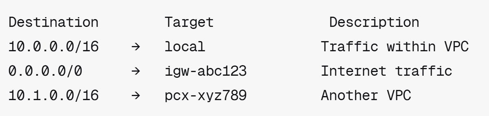
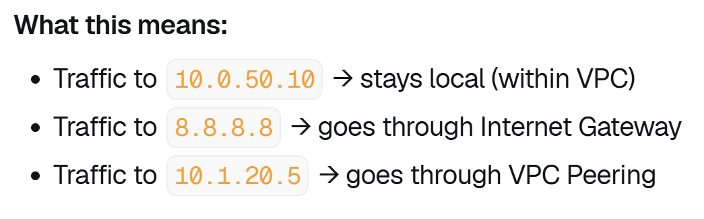

# Virtual Private Cloud (VPC)

A **Virtual Private Cloud (VPC)** is a logically isolated section of the Cloud where you can launch cloud resources in a virtual network that you define. Think of it as your own private data center within cloud, but with all the scalability and flexibility of cloud infrastructure.

You have complete control over your virtual networking environment, including:
* Selection of your own IP address range
* Creation of subnets
* Configuration of route tables and network gateways
* Security settings at multiple layers

**Proffessional def.**:
A VPC is a software-defined network within Cloud that provides isolated network infrastructure. It enables organizations to architect multi-tier applications with granular control over network topology, IP addressing (IPv4 and IPv6), routing policies, and security controls through Security Groups and Network ACLs. VPCs support hybrid cloud architectures via VPN and Direct Connect, enable service-to-service communication through VPC endpoints, and maintain network isolation through logical segmentation across availability zones for high availability and fault tolerance.

### Example of Node App EC2 connected to MongoDB EC2 (in both case use IAM EC2)

<!-- 

    <figure style="margin: 5px;">
        
        <figcaption style="text-align: center;">Road map of net to Node App with DB</figcaption>
    </figure>
    <figure style="margin: 5px;">
        
        <figcaption style="text-align: center;">Journey of a User Request</figcaption>
    </figure>
    <figure style="margin: 5px;">
        <figcaption style="text-align: center;">Diagram of Node.js and MongoDB in a VPC</figcaption>
    </figure>

 -->

#### **Why This Architecture Works:**
<ul>
    <li>Layered Security (Defense in Depth)
        <ul>
            <li>Even if someone hacks the load balancer, they can't reach the database</li>
            <li>Each layer only trusts specific previous layers</li>
        </ul>
    </li>
    <li>Principle of Least Privilege
        <ul>
            <li>Node.js can ONLY talk to MongoDB (not the internet)</li>
            <li>MongoDB can ONLY talk to Node.js (not even the internet)</li>
        </ul>
    </li>
    <li>High Availability
        <ul>
            <li>If you deploy across 2-3 Availability Zones, your app stays up even if one data center fails</li>
        </ul>
    </li>
    <li>Scalability
        <ul>
            <li>Add more Node.js instances behind the load balancer as traffic grows</li>
            <li>Database can be scaled independently</li>
        </ul>
    </li>
</ul>

## Why use, create or customise them?

**Key Reasons to Customize VPCs:**

1. Security & Isolation
    * Create isolated environments for different applications or teams
    * Implement defense-in-depth security architecture
    * Meet compliance requirements (HIPAA, PCI-DSS, etc.)

2. Network Control
    * Define your own IP address space using CIDR blocks
    * Control inbound and outbound traffic at subnet and instance levels
    * Implement custom routing strategies
    
3. Multi-tier Architecture
    * Separate public-facing web servers from private database servers
    * Implement DMZ (demilitarized zone) patterns
    * Create secure backend services without internet exposure

4. Hybrid Cloud Integration
    * Connect on-premises data centers to AWS via VPN or Direct Connect
    * Extend existing corporate networks into the cloud
    * Enable seamless migration strategies

5. Cost Optimization
    * Use VPC endpoints to avoid data transfer charges for AWS services
    * Implement NAT gateways only where needed
    * Optimize network architecture for traffic patterns

## Default VPC

Every AWS account comes with a default VPC in each region. Here's what it includes:

## The core components:

### a) SUBNETs

    <figure style="margin: 0; flex: 1; text-align: center;">
        
        <figcaption style="margin: 5px; text-align: left;">Example subnets:</figcaption>
        
    </figure>
    

        A <snap style="font-weight: bold;">subnet</snap> is a segmented range of IP addresses within a VPC. Subnets allow you to partition your VPC's IP address space and place resources in different network segments. Each subnet resides entirely within one Availability Zone and can be designated as public (internet-accessible) or private (isolated).
        
Symbolic simple: Subnets are like different floors in a building, in which the ground floor is the public subnet with doors to the street, so visitors can come in. Then the basement floor would be a private subnet has no street doors, it's only for people already inside the building. You put your web servers on the ground floor and your secret database in the basement.

        
Key Points:

        <ul>
            <li><snap style="font-weight: bold;">Public Subnet:</snap> Has a route to Internet Gateway, resources get public IPs</li>
            <li><snap style="font-weight: bold;">Private Subnet:</snap> No direct internet access, resources only have private IPs</li>
            <li><snap style="font-weight: bold;">One AZ:</snap> Each subnet lives in exactly one Availability Zone</li>
            <li><snap style="font-weight: bold;">CIDR Block:</snap> Each subnet has its own IP range (e.g., 10.0.1.0/24)</li>
        </ul>
    

### b) INTERNET GATWAY 

    <figure style="margin: 0; flex: 1; text-align: center;">
        
        <figcaption style="margin: 5px; text-align: left;">Example Internet Gateway:</figcaption>
        
    </figure>
    

        An <snap style="font-weight: bold;">Internet Gateway (IGW)</snap> is a horizontally scaled, redundant, and highly available VPC component that allows communication between your VPC and the internet. It performs Network Address Translation (NAT) for instances with public IPv4 addresses and enables both inbound and outbound internet traffic.
        
Symbolic simple: The Internet Gateway is like the main door to your house (VPC)! Without this door, you're stuck inside with no way to talk to the outside world!

        
Key Points:

        <ul>
            <li><snap style="font-weight: bold;">One per VPC:</snap> You can only attach one IGW to a VPC</li>
            <li><snap style="font-weight: bold;">Bidirectional:</snap> Allows both inbound and outbound traffic</li>
            <li><snap style="font-weight: bold;">Scalable:</snap> Automatically scales, no bandwidth constraints</li>
            <li><snap style="font-weight: bold;">Free:</snap> No charge for the IGW itself (only data transfer)</li>
        </ul>
    

### c) ROUTE TABLES

    <figure style="margin: 0; flex: 1; text-align: center;">
        
        <figcaption style="margin: 5px; text-align: left;">Example Route Tables:</figcaption>
        
        
    </figure>
    

        A <snap style="font-weight: bold;">Route Tables</snap> contains a set of rules (routes) that determine where network traffic from your subnet or gateway is directed. Each route specifies a destination CIDR block and a target (e.g., Internet Gateway, NAT Gateway, VPC Peering connection). Every subnet must be associated with a route table.
        
Symbolic simple: A Route Table is like a GPS or map with directions! When a letter (data packet) needs to go somewhere, it checks the route table: "Should I go to the neighbor's house (local VPC)? Or through the front door to the mailbox (Internet Gateway)? 

        
Key Points:

        <ul>
            <li><snap style="font-weight: bold;">One per VPC:</snap> You can only attach one IGW to a VPC</li>
            <li><snap style="font-weight: bold;">Bidirectional:</snap> Allows both inbound and outbound traffic</li>
            <li><snap style="font-weight: bold;">Scalable:</snap> Automatically scales, no bandwidth constraints</li>
            <li><snap style="font-weight: bold;">Free:</snap> No charge for the IGW itself (only data transfer)</li>
        </ul>
    

IP addresses:
- Public vs Private IP addresses
- IPv4 vs IPv6
 - CIDR blocks
 - Subnet masks
- Reserved IP ranges
- What is NAT?

Subnets:
- Public and Private subnets
- How do AZs relate to subnets?

Gateways:
- NAT Gateways vs Internet Gateways
- How do public subnets access the internet?
- Why do private subnets need NAT?
- Are there cost differences?
- Different architectures?

Route Tables:
- What does a "default" route table look like?
- Local routing
- 0.0.0.0/0 routing
- Routes to NAT gateway vs internet gateway
- How do RT association work?

SGs and NACLs:
- What are ports?
- Inbound vs Outbound rules
- Stateful vs stateless
- SG referencing
- Common SG architectures

Bonus:
- DNS
- Route53
- Different VPC designs

Reminders:
- Use images
- Make/link diagrams where possible
- Keep things fairly concise
- Guide should be usable by others
- Be ready to present your work tomorrow

If you finish the VPC documentation task, or get bored, you  could try to improve the security of our app and database deployment WITHOUT making/creating a VPC.

Some ideas:
- Disable public IP for the db instance
- Make SG rules only allow specific IP address for the db connection

If you do these or find other ways to improve security then please be open to sharing them tomorrow morning.