# Create VPC on AWS

## 1. Create VPC

Go to AWS VPC page and press create VPC

naming convention: `se-adel-2tier-vpc`  (2tier because --> App + MongoDB )
   
Follow the set up as image shows (tag are automat based on vpc name)

Set Up IPv4 CIDR: `10.0.0.0/16`

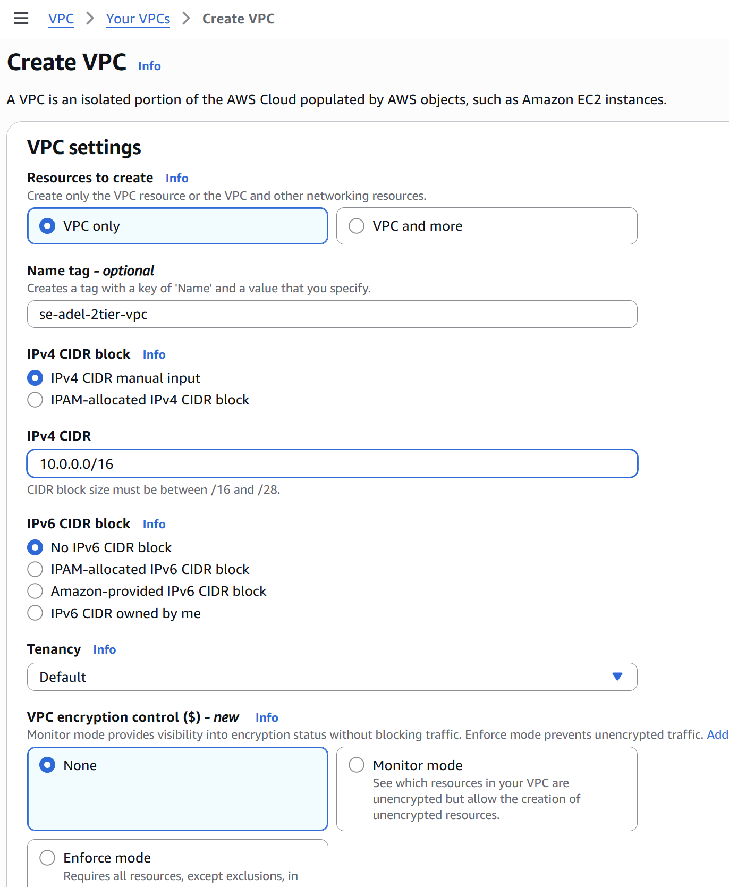

## 2. Create Subnet to VPC

Go to VPC Subnet section and create subnet to your VPC

Follow inst. ac image

Assing to the created VPC `se-adel-2tier-vpc`

To keep it simple, now we just picked up one availability zone to each subnet: 
public-subnet: `eu-west-1a` 
private-subnet: `eu-west-1b`

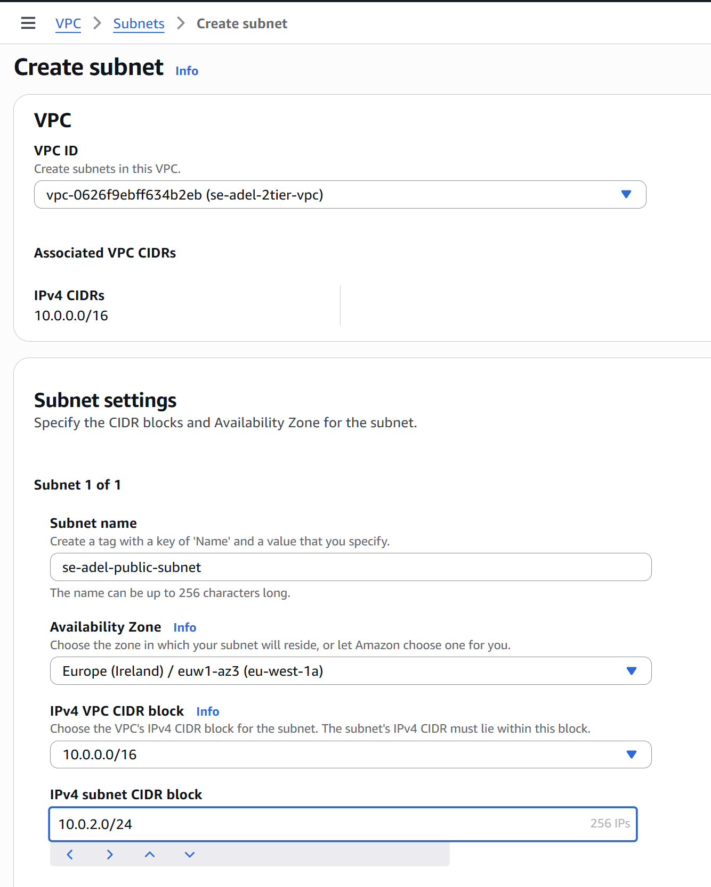

Create *Public Subnet*

Press Add new tag, and follow inst. ac image

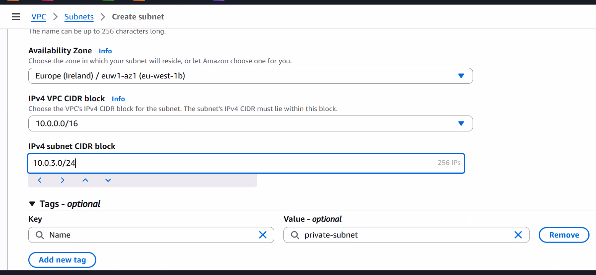

## 3. Create Internet Gateway to VPC

Follow inst ac image

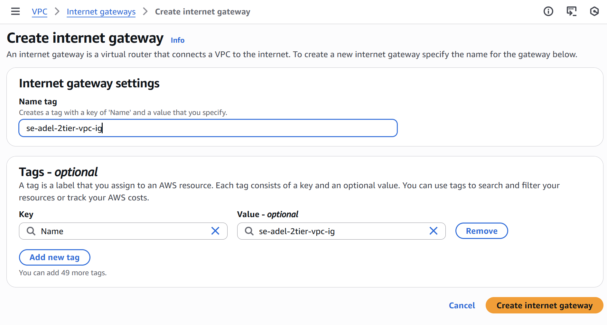

Attach the created `se-adel-2tier-vpc` to the Internet Gateway (see image)

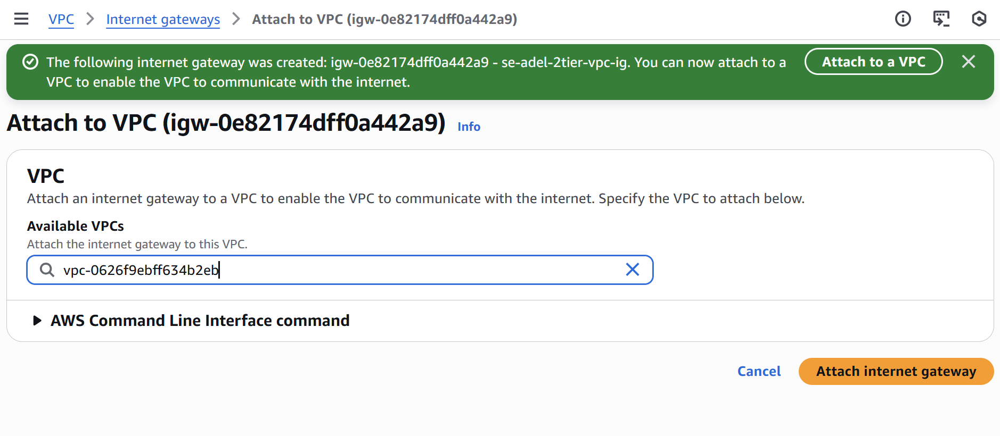

## 4. Create Route tables to VPC

1. Create Route Table (Follow inst. ac image)

naming convention: `se-adel-2tier-vpc-rt`

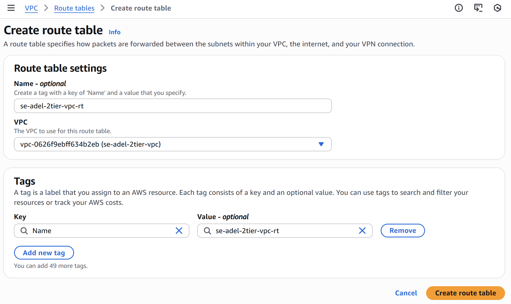

Press create Route Table ---> Navigate / Press on the created new Route Table

2. a) *Attach* the public subnet to your new Route table

Navigate to edit subnet association button part - (follow inst ac image)

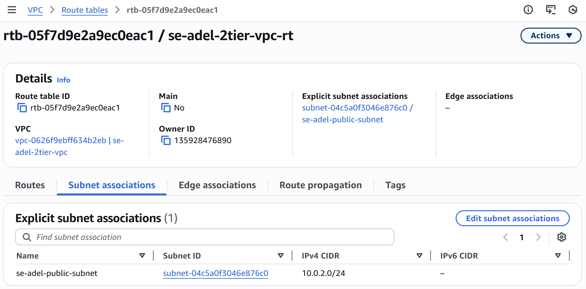

Attach the *public subnet* to the Route

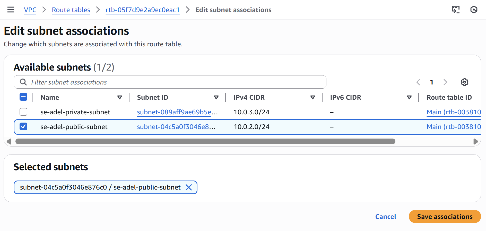

2. b) Add *Internet GateWay* to your new Route Table
(Follow inst ac image)

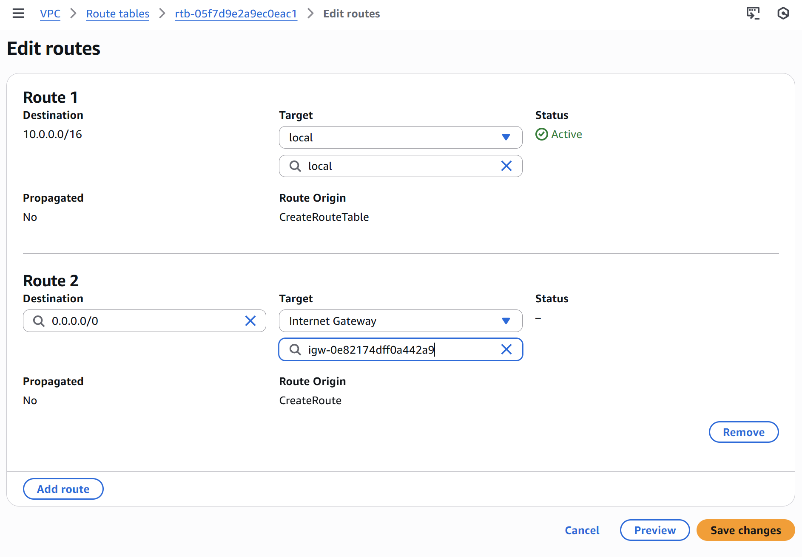

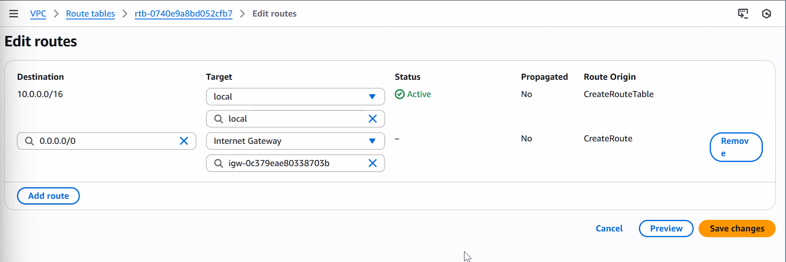

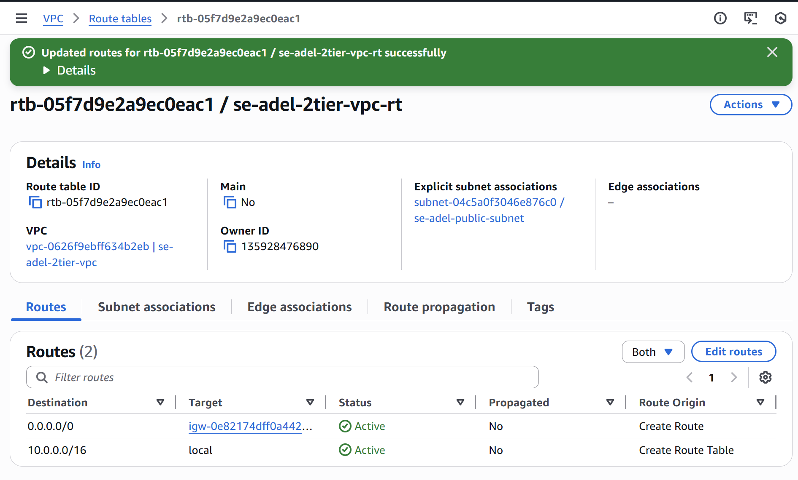

## 5. See the *Resource Map of the VPC* - Ready, Connected to the right subnets and routers

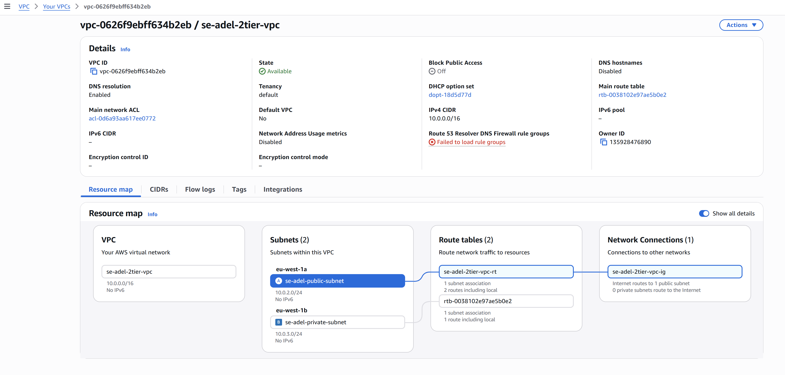