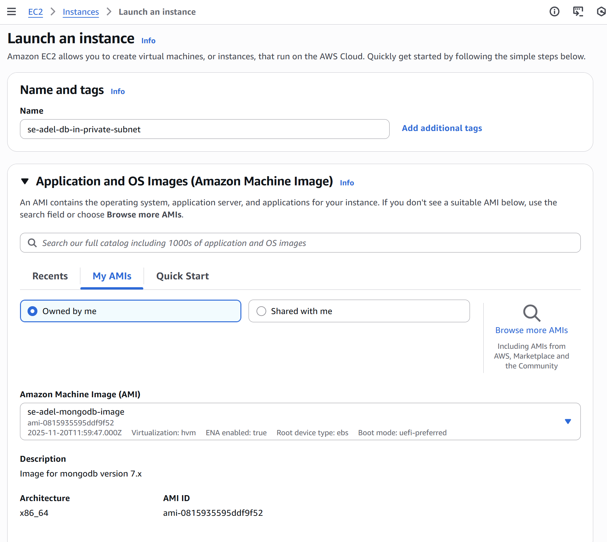
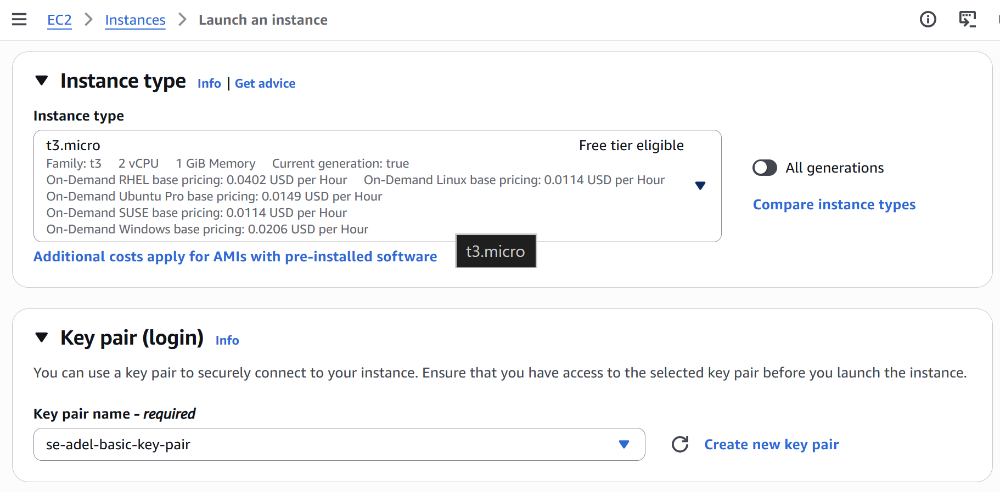
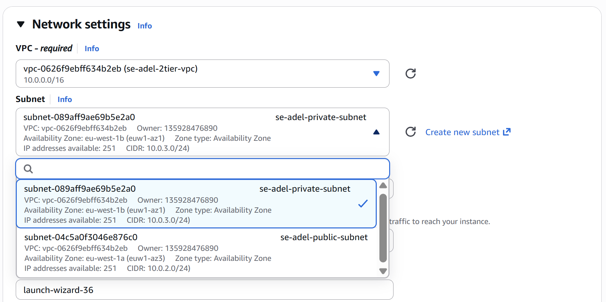
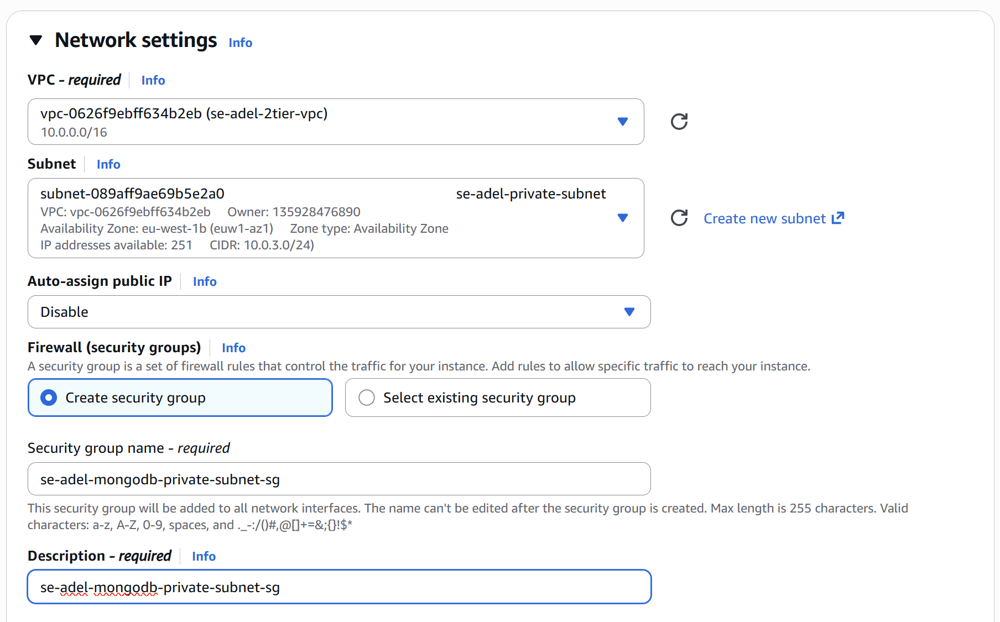
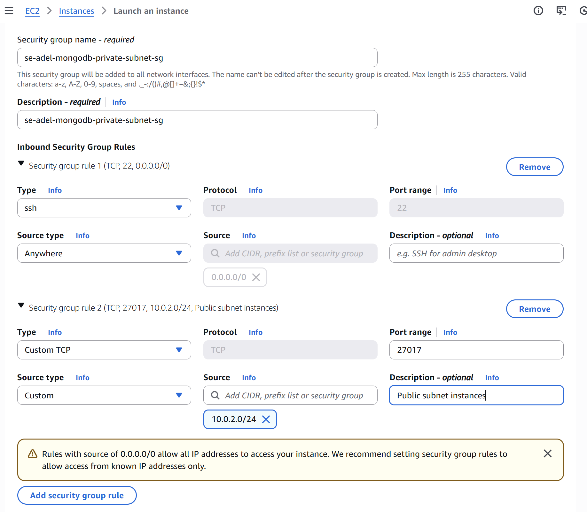
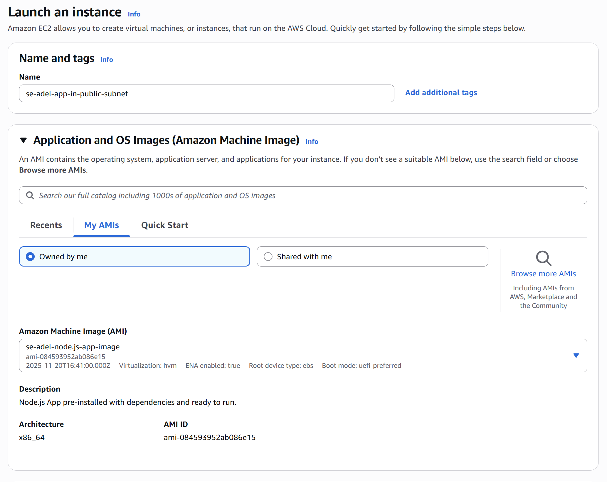
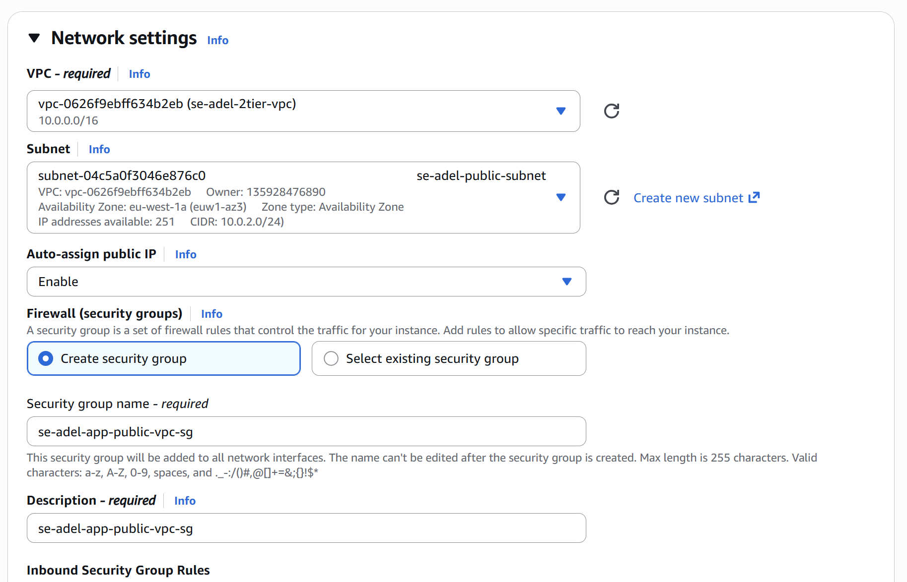
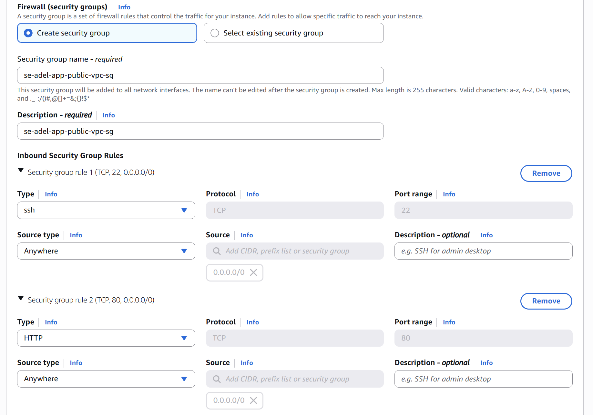
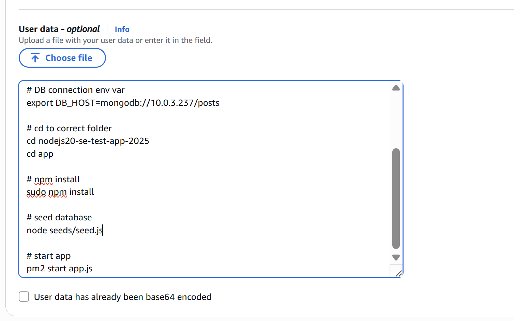
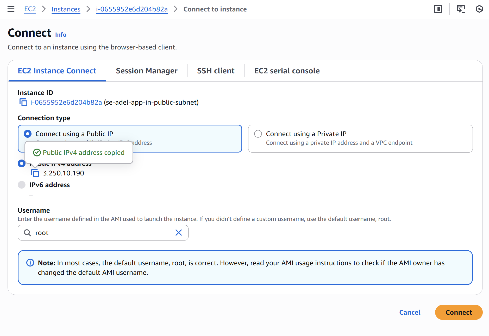

# Create PRIVATE IP connection IAM MongoDB EC2

Lanch EC2 (Follow inst ac image)

# Create PUBLIC IP connection IAM Node App EC2

Lanch EC2 (Follow inst ac image)

Place the `IAM_app_user_data.sh` script in the User Data ac image shows

# Check your deployed Application with MongoDB with your VPC

`http://<Public IP of Node App EC2>/posts`

### In case of Reboot of your Instances:

* The Public IP of MongoDB NOT going to change - So, it would run again withouth problem

* However, EC2 instance Only picks up User Data at the first time, when you lanch your Instance.
  
  Hence, you going to need to log into your EC2 in your `bash` terminal and redo some of the commands to start the node App.

  Bear in mind to use UBUNTU `ssh -i "se-adel-basic-key-pair.pem" ubuntu@108.129.123.72`  
  instead ROOT user `root@108.129.123.72`

  go into your app folder 
  `cd nodejs20-se-test-app-2025/app`

  DB connection env var 
  `export DB_HOST=mongodb://<PRIVATE IP MONGODB>:27017/posts`
    
  npm install  
  `sudo npm install`

  seed database 
  `node seeds/seed.js`

  start app 
  `pm2 start app.js`