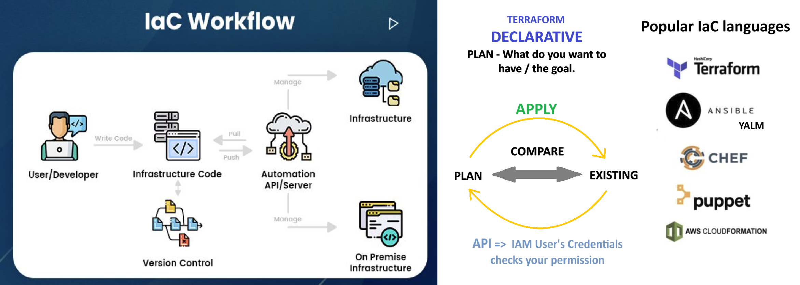
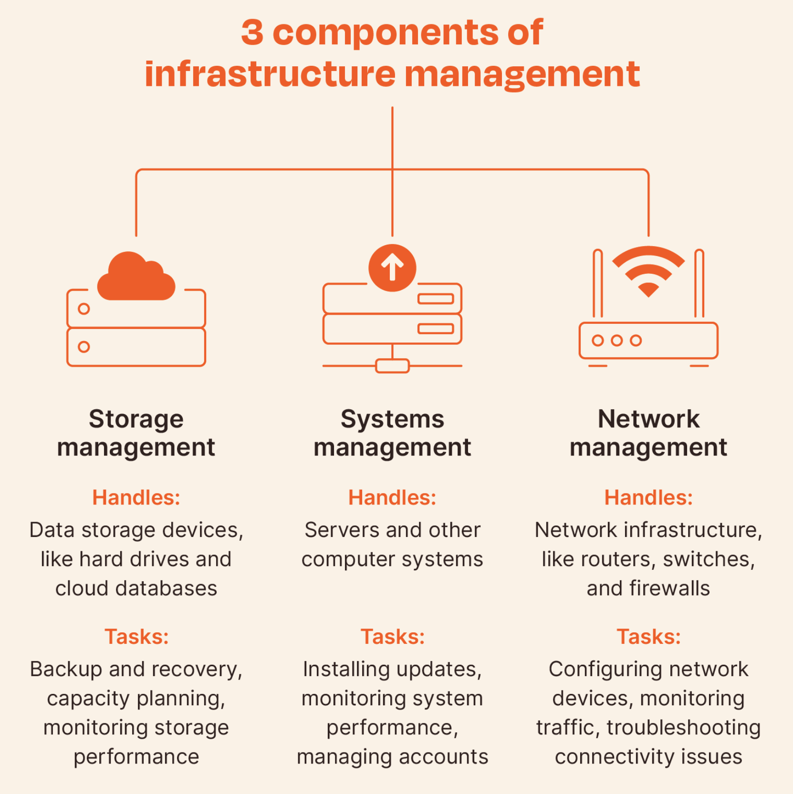
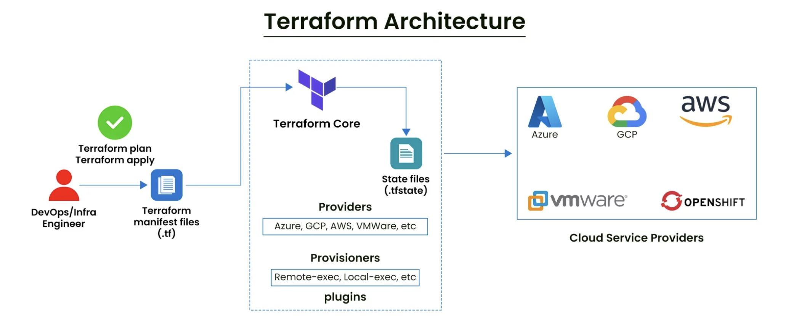
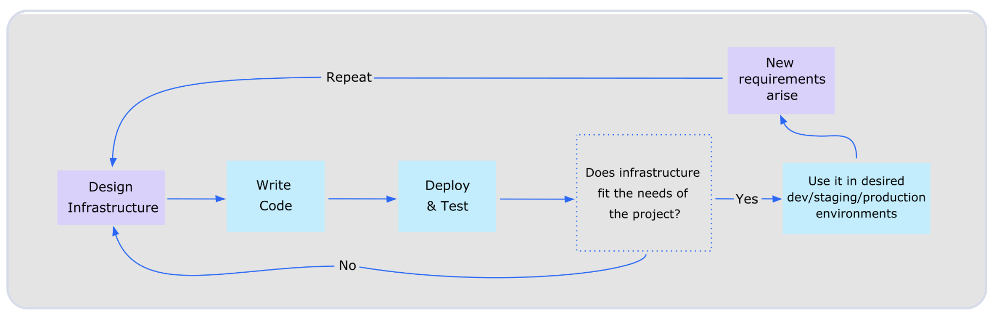
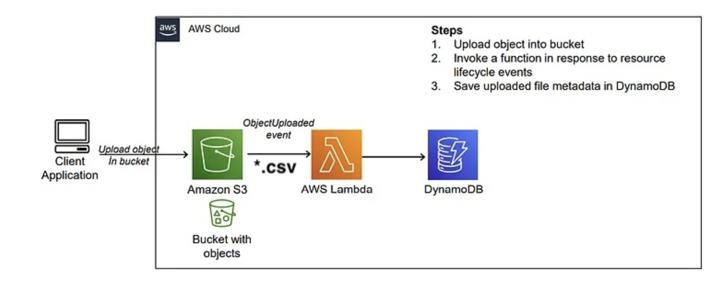
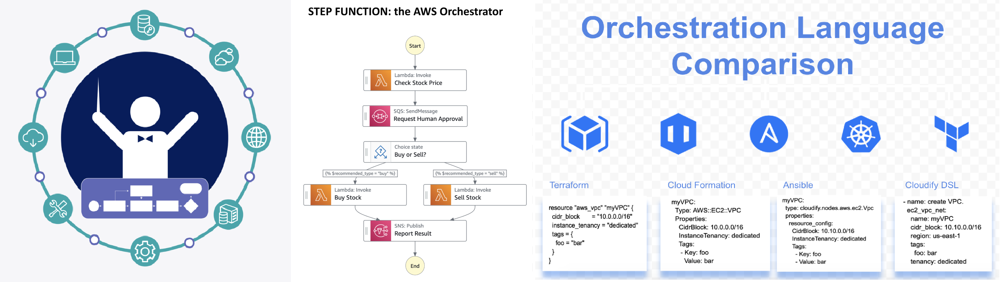
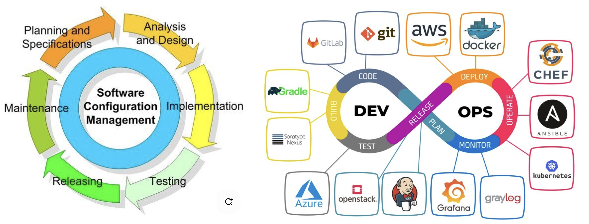
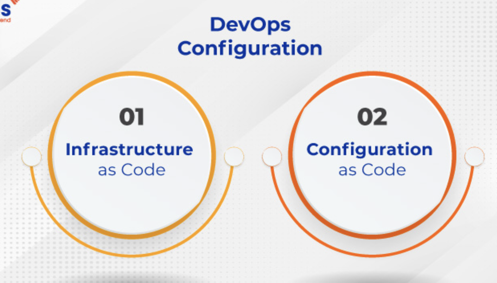

# Infrastructure as Code (IaC)

**IaC** is the process of **managing and provisioning** computer data centers through **machine-readable definition files**  (code), rather than manual hardware configuration or interactive configuration tools. Essentially, you write code to define what your servers, networks, storage, and other infrastructure components should look like, and an IaC tool takes care of making it happen. Instead of clicking buttons in a web console (like AWS or Azure) to create a server, you write code that describes what you want. 
*Managing and Provisioning:* just setting things up and keeping them running.

### Core Concepts of Infrastructure as Code:

* Declarative vs. Imperative:

    * **Declarative:** You define the desired state of your infrastructure, and the IaC tool figures out how to achieve it. Tools like Terraform and AWS CloudFormation are primarily declarative. For example, you declare you need a web server with specific characteristics, and the tool handles the provisioning and configuration steps.

    * **Imperative:** You define the specific commands or steps needed to reach the desired state. Tools like Ansible and Chef can operate in an imperative way. For example, you write a script that executes a series of commands to install and configure a web server.

* **Idempotence:** This is a crucial principle in IaC. It means that applying the same configuration multiple times produces the same result, without unintended side effects. If you run your IaC script again, it won't create a new server if one with the defined configuration already exists; it will ensure the existing one matches the defined state.

* **Version Control:** IaC files are treated like application source code. They are stored in version control systems like Git. This allows teams to track changes, collaborate effectively, revert to previous stable configurations if something goes wrong, and maintain an audit trail.

* **Automation:** IaC automates the entire infrastructure lifecycle, from provisioning to configuration and decommissioning. This significantly reduces manual effort and speeds up deployments.

### How Infrastructure as Code Works:

1. **Define:** You write code (e.g. Terraform, or YAML for Ansible) describing your infrastructure resources and their configurations.
2. **Version:** You commit this code to a version control system (e.g., Git).
3. **Deploy:** An IaC tool reads your code and interacts with the underlying platform (e.g. a cloud provider - AWS or Azure or GCP) to provision and configure the resources as defined.
4. **Manage State** (for some tools): Some tools, like Terraform, maintain a *"state file"* that keeps track of the current infrastructure. This helps the tool understand what resources it manages and how they map to your code.
5. **Update/Modify:** To change your infrastructure, you modify the code, test it, and then re-deploy. The IaC tool intelligently applies only the necessary changes to reach the new desired state.

### Advantages of Infrastructure as Code

* **Automation:** Reduces manual effort, freeing up engineers for more strategic tasks.
* **Speed & Efficiency:** Drastically accelerates provisioning and deployment cycles.
* **Consistency & Standardization:** Ensures every environment is provisioned the same way, reducing configuration drift.
* **Scalability:** Makes it easy to scale infrastructure up or down on demand.
* **Cost Savings:** Optimizes resource usage and reduces manual labor costs.
* **Version Control & Auditability:** Provides a clear history of changes and enables easy rollbacks.
* **Improved Reliability:** Minimizes human error through automation.
* **Enhanced Security:** Allows security policies to be codified and consistently applied.
* **Better Collaboration:** Fosters closer collaboration between development and operations teams (DevOps).
* **Disaster Recovery:** Enables quicker and more reliable recreation of infrastructure in a DR scenario.

 

  

# Terraform

Terraform is the industry leader for IaC, created by HashiCorp. 
Terraform is a **Code based DECLARATIVE way to build Coud Infrastructure.**  

It’s all about resources and declaration: "Stop thinking about the steps to build things. Just declare a list of resources (like a Shopping list) you want to exist, and let IaC (Terraform) figure out the math to make it happen." That's why *terraform state* file important. Every single time when you run terraform apply, it checks what you want to exist with the what you already have.

Automatise infrastucture deployment process, helps to keep efficient your infrastructure system.

### Terraform it an Orchestration tool.

Terraform is an orchestrator because it doesn't just "install things"; it manages the entire environment. It knows that it cannot build a "Web Server" until the "Network" is built first. It manages those relationships and dependencies across many different services (like AWS, Google Cloud, and even Spotify or Cloudflare) at the same time.

### How does Terraform work?

1. **Write:** You write your requirements in a language called HCL (HashiCorp Configuration Language). 
    **Init**: Initalize terraform on your machine.

2. **Plan:** Terraform looks at what you have currently and compares it to your code. It shows you a "Plan" (e.g., "I am going to add 2 servers and delete 1").

3. **Apply:** You say "go," and Terraform makes the API calls to the cloud provider to build it.

4. **State:** Terraform keeps a "State File"—a secret diary where it remembers exactly what it built so it can manage it later.

### What are the advantages of Terraform?

* **Multi-Cloud:** You can use the same tool for AWS, Azure, and Google Cloud.

* **Speed & Safety:** You can deploy 100 servers in minutes, and because it’s code, you won't make "human" clicking mistakes.

* **Version Control:** Since it’s just text files, you can save your infrastructure in GitHub and see exactly who changed what and when.

* **Idempotency:** A fancy word meaning: if you run the code twice, it won't build double the stuff; it will realize everything is already there and do nothing.

 

  

# Orchestration and Configuration Management 
These two often work together, but they have different jobs.

## Orchestration (The "Conductor") 
Orchestration is about managing the lifecycle and workflow of complex systems. It’s the "high-level" work: starting a server, connecting it to a database, and setting up the network.

Think of an Orchestra Conductor. They don't play the violin; they tell everyone when to start, when to stop, and how to work together so the music sounds good.

## Configuration Management (The "Decorator") 
Configuration Management focuses on what happens inside the server. It ensures specific software is installed, security updates are applied, and settings are correct. (Examples: Ansible, Chef, Puppet).

Think of the Decorator who goes inside your 'house' once it has been built for making sure the lights work, the furniture is in the right room, and the walls are painted blue etc

**Configuration management in DevOps** involves outlining, modifying, releasing, overseeing, documenting, and reporting the arrangement of items within a system, regardless of the sequence. It’s akin to ensuring you have all the puzzle pieces when assembling a puzzle. When implemented effectively in DevOps transformation, the configuration management process enables developers to make swift and efficient system changes without causing disruptions.

Implementing **Configuration as Code (CaC)** involves managing and configuring your system and applications through code rather than manual modifications. This approach enables the tracking of changes, facilitates testing, and allows for automation, mirroring the processes applied to your application’s code. 
  

## RESOURCES

* [Blog - IaC](https://www.automq.com/blog/infrastructure-as-code-iac-vs-traditional-infrastructure-management#the-infrastructure-as-code-lifecycle)

* [Blog - IaC](https://www.altexsoft.com/blog/infrastructure-as-code/)

* [Blog - Terraform](https://www.pynetlabs.com/terraform-architecture/)

* [Blog - Coude Orchestration Comparision](https://devops.com/cloud-orchestration-language-roundup-a-comparison/)

* [Digital ocean - Terraform - IaC](https://www.digitalocean.com/community/conceptual-articles/infrastructure-as-code-explained)

* [DevOps Configuration Management BlogP](https://donedeploy.com/devops-configuration-management-tools/)

* [DevOps Configuration Management - Well Explained](https://www.veritis.com/blog/devops-configuration-management-guide-to-top-tools/)

* [Article about Anthropic Claude Sonnet 3 for Generating AWS Infrastructure Diagram - Image Genarator](https://aws.amazon.com/blogs/machine-learning/architecture-to-aws-cloudformation-code-using-anthropics-claude-3-on-amazon-bedrock/)

* For future [AWS Agentic AI articles](https://aws.amazon.com/ai/agentic-ai/?nc2=h_l1_f)