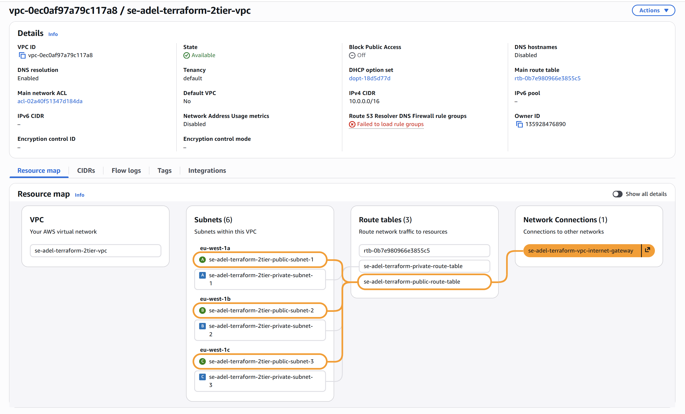
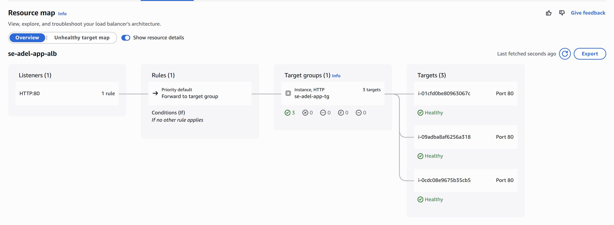
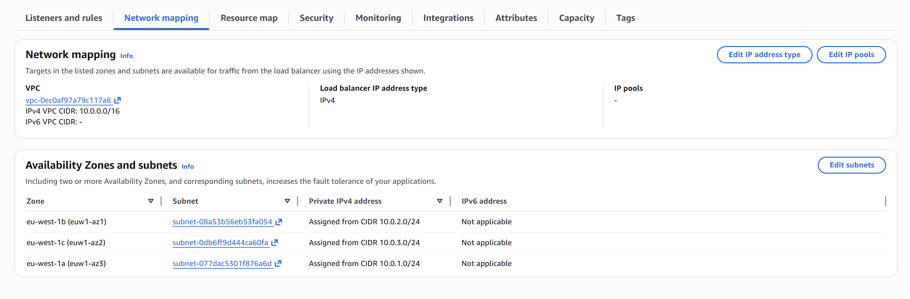

# Custom VPC deployment with Multy Zones, added NAT Instance and Health checks/balance 

Node.js app with MongoDB deployed on custom VPC, Private and Public subnets that has muliple avalibility zones, added NAT Instance for aim to Private tier DB securely could connect to Net for updates withouth a rist of net exposure/attacks. 

`http://se-adel-app-alb-1720057335.eu-west-1.elb.amazonaws.com/posts`







## NAT gateway would have been a better approach with Elastic IP address

Best practice would be to create an Elastic IP for NAT GateWay<br>
Since I had no permission to NAT Gateway, I set up a NAT Instance

### For demonstration purpose, this would been the NAT Gatway approach:

Add the following code to the existing one:
```
# Elastic IP for NAT Gateway (placed in the first public subnet)
resource "aws_eip" "nat_eip" {
  depends_on = [aws_internet_gateway.gw]
  tags = {
    Name = "se-adel-terraform-nat-gateway-eip"
  }
}

# NAT Gateway (placed in the first public subnet only)
resource "aws_nat_gateway" "nat_gw" {
  allocation_id = aws_eip.nat_eip.id
  subnet_id     = aws_subnet.vpc_public_subnet[0].id
  depends_on    = [aws_internet_gateway.gw]

  tags = {
    Name = "se-adel-terraform-nat-gateway"
  }
}

# Private Route Table (Routes internet traffic via NAT Gateway)
resource "aws_route_table" "private_route_table" {
  vpc_id = aws_vpc.main_vpc.id

  route {
    cidr_block     = var.rt_cidrs
    nat_gateway_id = aws_nat_gateway.nat_gw.id
  }

  tags = {
    Name = "se-adel-terraform-private-route-table"
  }
}
```

And Remove the following from the current version:

```
# Private Route Table (Routes internet traffic via NAT Instance)
resource "aws_route_table" "private_route_table" {
  
}
```

```
# Data source to fetch the primary network interface ID of the NAT Instance
data "aws_network_interface" "nat_eni" {
  
}
```

```
# Route for Private Subnets to NAT Instance
resource "aws_route" "private_nat_route" {

}
```

